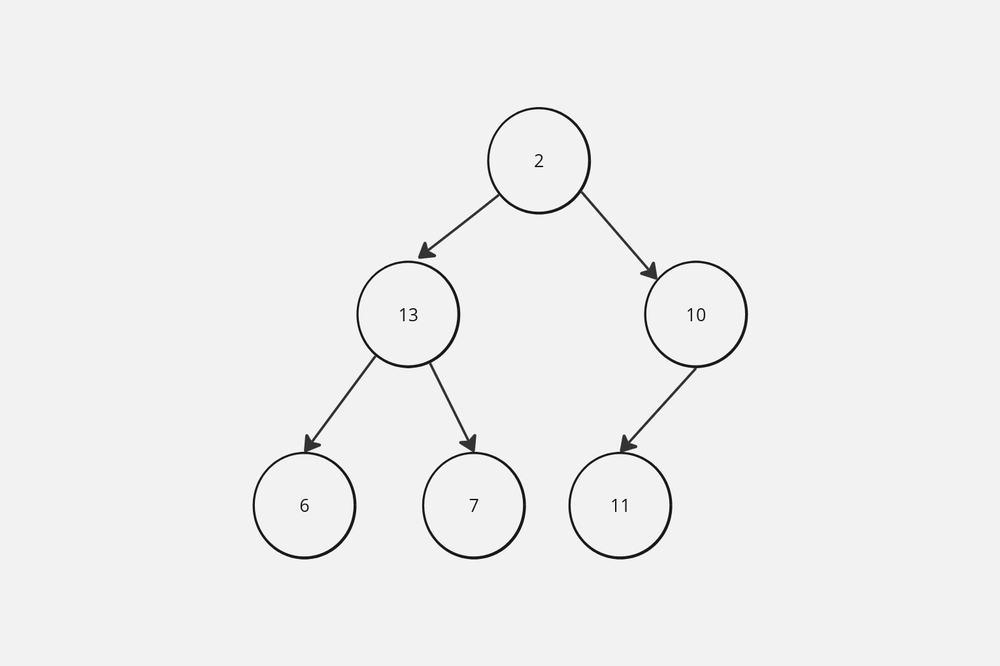

Heap Sort is one of the most efficient algorithms on record, although it's easy to miss it when reviewing the various sorting algorithms that exist such as MergeSort, QuickSort, etc.

Use a Binary Max Meap

What is a Max Heap or Binary Max Meap?

A Max Heap, or a Binary Max Heap, is a tree-based data structure that satisfies the following properties:

-  Shape Property: The tree is a complete binary tree, meaning that all levels of the tree, except possibly the last level, are completely filled, and all nodes in the last level are as far left as possible.

-  Heap Property: Every node in the tree is greater than or equal to (≥) its children. This means that the root node is the maximum element in the heap.

The key characteristics of a Max Heap are:

  - The root node always contains the maximum value in the heap.
  - The left and right child nodes of any node are always less than or equal to the parent node.
  - The heap is a complete binary tree, meaning that all levels of the tree are filled, except possibly the last level, which is filled from left to right.

This structure allows for efficient implementation of operations like finding the maximum element, inserting a new element, and removing the maximum element (also known as the "heap top") in O(log n) time complexity, where n is the number of elements in the heap.

Max Heaps are commonly used in algorithms like heapsort, priority queues, and various optimization problems, where finding the maximum (or minimum) element quickly is important.

Steps Involved:

1. Build a max heap
   In order to implement max heap, we can use either the traditional implementation of a max heap as a tree or use an array. In this example, we'll use an array due to simplicity, faster performance due to caching and reduced memory overhead.

   

   ### Array Representation of Binary Tree

   Given index i of an element in an array

   the index of left child is given by 2i + 1

   the index of right child is given by 2i + 2

   The parent node is given by i - 1 /2

   

```
  // Build a max heap
     const heapifyDown = (arr, n, i) => {
  let largest = i;
  let left = 2 * i + 1;
  let right = 2 * i + 2;

  if (left < n && arr[left] > arr[largest]) {
    largest = left;
  }

  if (right < n && arr[right] > arr[largest]) {
    largest = right;
  }

  if (largest !== i) {
    [arr[i], arr[largest]] = [arr[largest], arr[i]];
    heapifyDown(arr, n, largest);
  }
};

const buildMaxHeap = (arr) => {
  const lastParentIndex = Math.floor((arr.length - 2) / 2);

  // Heapify from the last parent index up to the root
  for (let i = lastParentIndex; i >= 0; i -= 1) {
    heapifyDown(arr, arr.length, i);
  }
};

```

2.  Heap Sort
    The next step is to perform the heap sort. The sorting procedure basically entails the following steps

    1. Swap


        Swap the root element with the last element of the array

    2. Remove

       Reduce the size of the array by removing the last element

    3. Heapify

       Heapify the resulting array

```
const heapify = (arr) => {
for (let i = arr.length - 1; i > 0; i -= 1) {
  [arr[0], arr[i]] = [arr[i], arr[0]];
  heapifyDown(arr, i, 0);
}
};

```

```

// Putting everything together:
const heapSort = (arr) => {
buildMaxHeap(arr); // Build max heap

heapify(arr); // Perform heap sort
}

```
