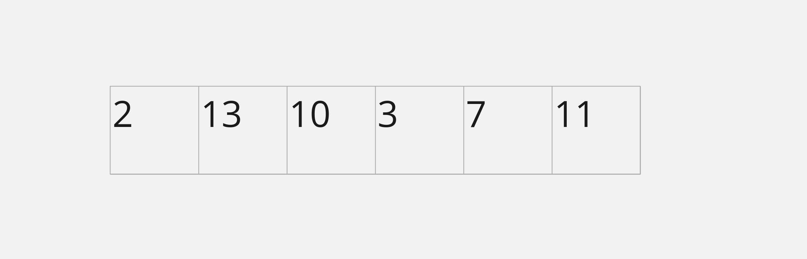

I recently had to solve a problem using a Max Heap. I kind of fumbled through it but this what I eventually came up with. 

## Application Question

Write a function that takes in an array of N integers and performs a given operation k times. Afterwards return the outcome

Operation: 
- Choose any number
- Calculate the cieling of a third of that number
- Replace the number in the array with this result
- Add that number to max score

First Solution

```
const max_score = (nums, k)=>{
 let max_result = 0

  for (let i = 0; i < k; i += 1) {
    let choice = Math.max(...nums)

    max_result += choice

    let index = nums.indexOf(choice)

    nums[index] = Math.ceil(choice / 3);

  }
  return max_result


}
```

Second Attempt

```
const max_score = (nums, k)=>{
 let max_result = 0

 const sortedNums = [...nums].sort((a, b) => b - a)

  for (let i = 0; i < k; i += 1) {
    let choice = sortedNums[i] 
    
    max_result += choice

    let index = nums.indexOf(choice)

    nums[index] = Math.ceil(choice / 3);

  }
  return max_result
}
```

Best Solution
Use a Binary Max Meap

What is a Max Heap or Binary Max Meap?

A Max Heap, or a Binary Max Heap, is a tree-based data structure that satisfies the following properties:


    Shape Property: The tree is a complete binary tree, meaning that all levels of the tree, except possibly the last level, are completely filled, and all nodes in the last level are as far left as possible.

    Heap Property: Every node in the tree is greater than or equal to (≥) its children. This means that the root node is the maximum element in the heap.

The key characteristics of a Max Heap are:

    The root node always contains the maximum value in the heap.
    The left and right child nodes of any node are always less than or equal to the parent node.
    The heap is a complete binary tree, meaning that all levels of the tree are filled, except possibly the last level, which is filled from left to right.

This structure allows for efficient implementation of operations like finding the maximum element, inserting a new element, and removing the maximum element (also known as the "heap top") in O(log n) time complexity, where n is the number of elements in the heap.

Max Heaps are commonly used in algorithms like heapsort, priority queues, and various optimization problems, where finding the maximum (or minimum) element quickly is important.
 
Steps Involved:
1. Build a max heap
     In order to implement max heap, we can use either the traditional implementation of a max heap as a tree or use an array. In this example, we'll use an array due to simplicity, faster performance due to caching and reduced memory overhead.

     

     ### Array Representation of Binary Tree

     Given index i of an element in an array 
     
     the index of left child is given by 2i + 1

     the index of right child is given by 2i + 2

     The parent node is given by i - 1 /2

     

```
// Code to build a max heap
     
const heapifyDown = (nums, n, i) => {
  let largest = i;
  let left = 2 * i + 1;
  let right = 2 * i + 2;

  if (left < n && nums[left] > nums[largest]) {
    largest = left;
  }

  if (right < n && nums[right] > nums[largest]) {
    largest = right;
  }

  if (largest !== i) {
    [nums[i], nums[largest]] = [nums[largest], nums[i]];
    heapifyDown(nums, n, largest);
  }
};

const buildMaxHeap = (nums) => {
  const lastParentIndex = Math.floor((nums.length - 2) / 2);

  // Heapify down from the last parent index(non-leaf node) up to the root
  for (let i = lastParentIndex; i >= 0; i -= 1) {
    heapifyDown(nums, nums.length, i);
  }
};
     
```

2. Find Max Score
  The next step is to find the maximum score in k operations.
  steps
  - Record the max value (this is retrieved from the root)
  - Extraction of max;
    1. Swap

      Swap the root element with the last element of the array

    2. Remove

       Reduce the size of the array by removing the last element
    3. Heapify

       Heapify down the resulting array
  - Insertion of the new value

    1. This is added to the back of the array
    2. Heapify up the resulting array


  ``` 
  const heapifyUp = (nums, index) => {
  // Heapify from the last parent index up to the root
  while (index > 0 && nums[Math.floor((index - 1) / 2)] < nums[index]) {
    [nums[Math.floor((index - 1) / 2)], nums[index]] = [
      nums[index],
      nums[Math.floor((index - 1) / 2)],
    ];
    index = Math.floor((index - 1) / 2);
  }
 };

  const insert = (nums, value)=>{
    nums.push(value);
    heapifyUp(nums, nums.length - 1);
 }


   const delete = (nums) => {
    [nums[0], nums[nums.length - 1]] = [nums[nums.length - 1], nums[0]];
    nums.pop();
    heapifyDown(nums, nums.length, 0);
  }
// Putting everything together
  
const maxScore = (nums, k) => {

  buildMaxHeap(nums); // Build max heap

  let maxValue = 0;

  for (i = 0; i < k; i++) {
    const score = nums[0]; // Retrieve max value

    maxValue += score;

    // Remove the max value from the heap
    remove(nums);

    // Insert the new value to the heap
    const value = Math.ceil(score / 3);
    insert(nums, value);
  }

  return maxValue;
};


  ```


